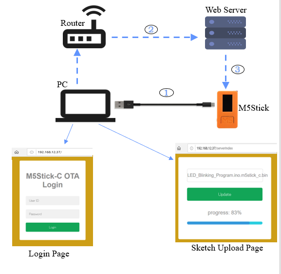

# ESP32-M5StickC-OTA-Over-the-Air-Web-Updater

## OTA(Over the Air) Programming

- OTA programming allows updating/uploading a new program to M5Stick-C using Wi-Fi instead of requiring the user to connect the M5Stick-C to a computer via USB to perform the update. But the first sketch should be uploaded via serial port.

- OTA functionality is extremely useful in case of no physical access to the M5Stick-C module. It helps reduce the amount of time spent for updating each M5Stick-C module at the time of maintenance.

- The only disadvantage is that you have to add an extra code for OTA with every sketch you upload, so that you’re able to use OTA in the next update.

- I have made a OTA Web Updater that allows you to update/upload new code to your M5Stick-C using a browser, without the need to make a serial connection.

## OTA Web Updater 

- Upload OTA Routine Serially: The first step is to upload the sketch containing OTA routine serially. It’s a mandatory step, so that you’re able to do the next updates/uploads over-the-air.

- Access Web Server: The OTA sketch creates a web server in STA mode which can be accessed via web browser. Now login to the web server.

- Upload New Sketch Over-The-Air: Now, you can upload new sketches to the M5Stick-C by generating & uploading compiled .bin file through a web server.

